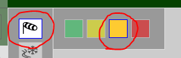
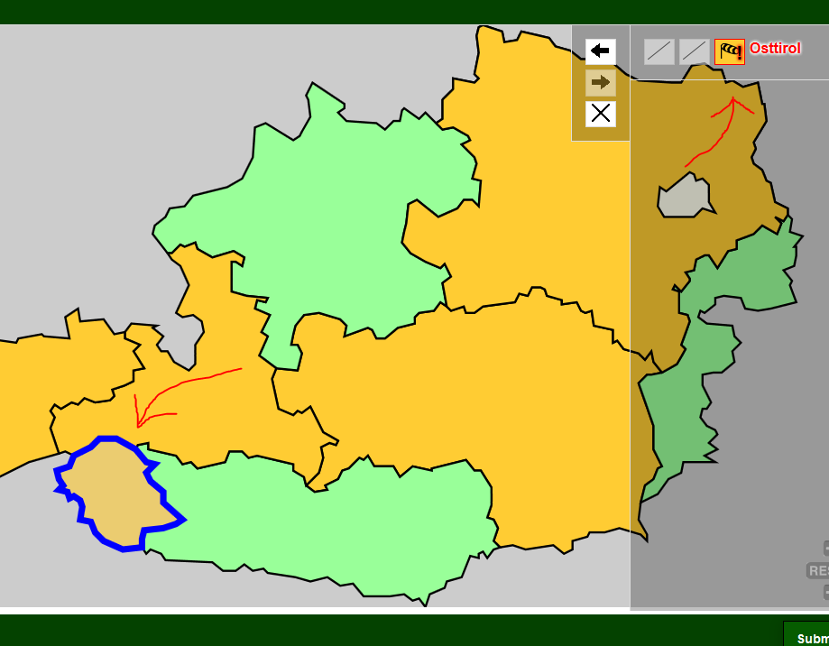
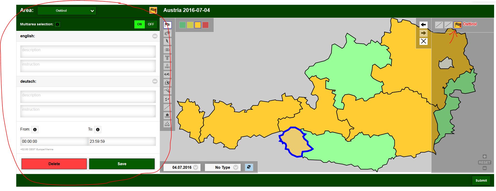
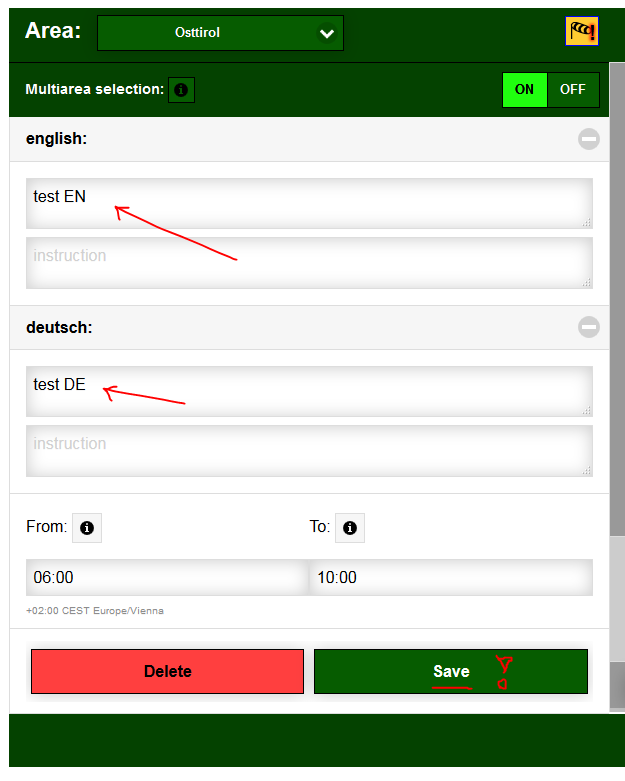
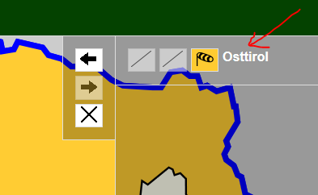
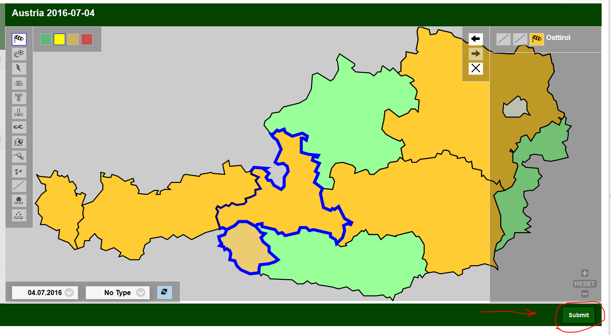
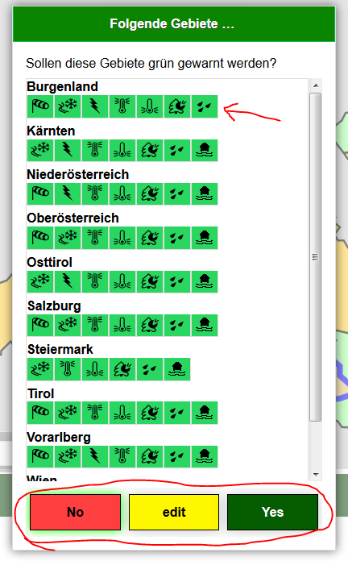
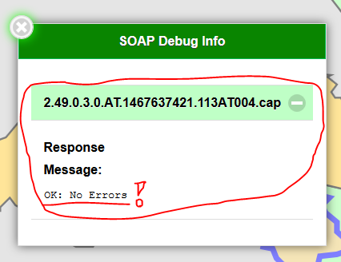

[**Back to Readme**](../README.md)

Paint and Alert Application
---------------------------

### Introduction

The new addition to the Cap-PHP-Library, **Paint and Alert**, was developed for Meteorological Forecast-Institutes without softwaredevelopement.

The Cap-PHP-Library was extended so that...  
a user which is logged in to the Meteoalarm webservice

and has the permissions to warn a certain country via CAP-Import

... is shown an additional application called Paint and Alert in the menu.

The visual interface eases the input and saves a lot of hassle with the necessities of the Cap-Standard. We spare the user every setting that is not absolutely necessary. **Paint and Alert** was developed with a responsive design that is fully supported by tablets. The interface resembles a paint program.

The shown country is configured via the ISO code in the configuration page. The map (a SVG-map), the awarenesstypes and the awarenesslevels are imported from the Meteoalarm-server based on the selected country and the users permissions on Meteoalarm.

The interface includes three toolboxes  

-   **Awarenesstoolbox** (with the possible types and levels)
-   **Meteoalarm toolbox** (to retrieve warnings from meteoalarm)
-   **Map Toolbox** (on the left next to the Processlist - with the functions to undo, re-undo and reset of the mapselection)

and in addition:

-   the **Map**
-   the **Processlist** (on the right)
-   the **Warningsdetails** (on the left)
-   and the **Actionbar** (at the bottom)

### The Logic - First steps

The application utilizes a “multiple ways” usability concept. For the purpose of simplicity we will show a single way of logical sequence:

Step 1 (the Meteoalarm Toolbox)  

In the Meteoalarm Toolbox you can select the day and type you want to edit. The defaultvalue is “today” when selecting the day and “without filters” when selecting the type. By pressing the update-button the selected day and type is imported from Meteoalarm. If warnings or areas were edited beforehand you are warned that this data is lost by updating from Meteoalarm.

Step 2 (selecting the areas to edit on the map)  

After pressing the update-button the map is updated with the current warnings from Meteoalarm and is ready to be edited. By clicking an area on the map all active warnings in this area are shown in the Processlist and the area is highlighted with blue border. In the Processlist (on the right) the warnings are shown in the form of the Meteoalarm awarenessicons and can be selected with these icons. Selected warnings can be edited or deleted in the Warningsdetails (on the left).

There are three possible warnings per area in the Processlist. A new warning can be created by selecting an empty warningsfield.

Step 3 (sending warnings to Meteoalarm)  

The newly created and modified warnings can be sent to Meteoalarm via the submit-button, once all necessary forms have been filled. If there are leftover white areas for the selected day you are asked, whether you want to (de)warn these areas green.

### Add new warnings

First the type is selected in the **Awareness Toolbox**. After the type is selected a menu opens that offers the available levels (colors). With the selected level you can click on areas to create a new warning in that area with the chosen type and level. The new warning is displayed in the Processlist.

By selecting the warning (via the warningicon in the Processlist) the form on the left becomes available. There you can edit the warnings **warningsdescription** , instructiontext and start-end-date.

To save the warning click the **save-button**.

If the warning was sucessfully saved (warningsdescription , instructiontext and start-end-date are mandatory) the exclamation mark on the warningicon is removed.

### Sending warnings to Meteoalarm

  
On the right in the actionbar is the **Submit-button**

The Submit-button starts the transfer of the with “Paint and Alert” modified and created warnings to Meteolarm and inquires whether the remaining areas, without warnings, should be (de)warned green.

<!-- -->

  
After you answered this question you are asked whether you want to send the warnings to Meteoalarm.

By confirming, all produced CAP-files will be sent to the Meteoalarm webservice. The results of the transfer will be presented in the Debug-Info (fig. 8) in the form of green (OK) and red (Error) entries. By clicking an entry the transfer details (fig. 9) will open. After the transfer the application will check every ten seconds whether Meteoalarm has already processed the warnings. When Ḿeteoalarm has processed the warnings the application will ask to reload the website.

### Change the warned Day

The option change the warned day is in the middle of the bottom bar. After selecting the application must be reloaded with the reload button to the right. Now all produced warnings are for the specified day.

### Change the Type of warnings

By using the Drop-down menu to the right of the day selection it is possible to only show warnings of that type. This effects only the data loaded fr